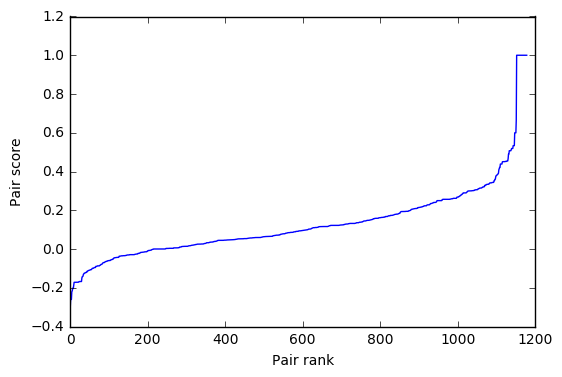
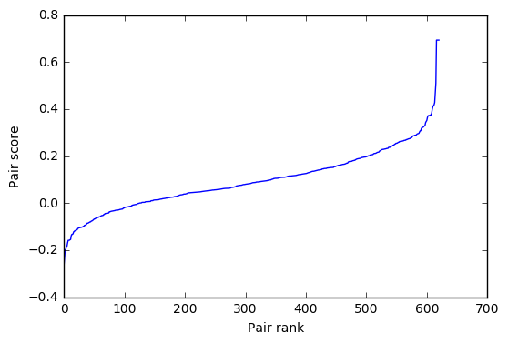
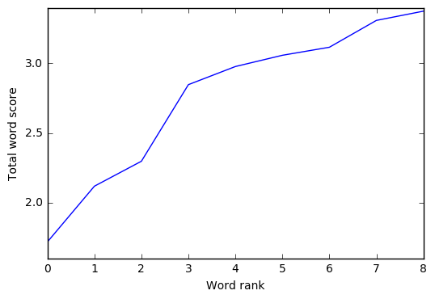

# A minimal system for Question Answering

* Note: This project was done in 2017 as a part of an application for an AI Engineer position. Specific info has been omitted/replaced *

The challenge: Selecting the correct answer out of five possible answers to a posed question. The dataset is provided for language modeling, containing candidate answers as well as the correct answer. Basic preprocessing involved removing non-alphanumeric characters, stemming and removing stopwords.

The main assumption behind our approach is that correct answers to a question tend to have a higher degree of related words with the question. In this writeup, we will describe and critique a number of models with increasing sophistication until we reach the final model.

## Naïve Model
An initial approach to the problem is to select the answer that has the largest number words also contained in the question, as shown in Figure 1.

```
Question:
	Where is the arctic circle located on the earth?
Answers and scores:
	Score 10.00	The Arctic Circle is one of the ... [83 stems]
	Score 1.00	     In 2012 , it is the parallel of l... [25 stems]
 +	Score 43.00	Map of the Arctic with the Arcti... [939 stems]
 *	Score 11.00	The Arctic Circle is the southe... [156 stems]
	Score 10.00	North of the Arctic Circle , th... [172 stems]
```
**Figure 1**: First model. Guess (indicated by +) is not the same as the correct answer (indicated by *).

The results are not promising: It doesn't get the correct answer most of the time, with a p@1 score of only 6%, actually worse than random chance of 20%. However, this model rewards long sentences and doesn't consider similar words which can severely impact our guesses.

To remedy these issues, we will normalize any answer scores by its length and use word embeddings. Word embeddings can be used as a score by comparing pairwise similarity between question and answer token embeddings.

## Initial Word Embedding Model
Word2Vec is a RNN that encodes words according to their semantic proximity, under the assumption that context implies semantic proximity, and will be used here to derive word embeddings by training on the provided corpus.
An initial (and final) guess of 150 dimensions was deemed appropriate for the embeddings, for no good reason other than comparing hyperparameters and re-running experiments would take very long, but this could be done with more time and computing resources. 

The results are better, with p@1 at 37%. Figure 2 shows the model now gets the correct answer for the previously shown question:

```
Question:
	Where is the arctic circle located on the earth?
Answers and scores:
	Score 0.09	   The Arctic Circle is one of the ... [83 stems]
	Score 0.13	   In 2012 , it is the parallel of l... [25 stems]
 * +	Score 0.08	   Map of the Arctic with the Arcti... [939 stems]
	Score 0.07	   The Arctic Circle is the southe... [156 stems]
	Score 0.07	   North of the Arctic Circle , th... [172 stems]
```
**Figure 2**: Initial word embedding model. The question is now correctly answered.

However, upon close inspection of word embedding scores such as in Figure 3, there are still issues with the model. Answers that repeat a related word several times get better scores with linear growth, even if other important terms in the question are ignored.



**Figure 3**: Question and Answer word pair scores.



**Figure 4**: Log smoothing on QA pairs.

## Word Embedding With Diminishing Returns
To avoid rewarding an answer too much for repeating a question word several times, the scores will instead be on a log scale of term frequencies. For the same question-answer combination as before, the chart is a bit smoother as shown in Figure 4. The results are significantly better, with p@1 at 61%.

## Word Embedding With Diminishing Returns and Completion
Although the returns for repeating related words are diminishing, answers with many of them may still come on top of answers that touch on a greater number of words related to the question. Answers should be rated on how much they cover the question topics.



**Figure 5**: Answer scoring for each word in Question.

One way to accomplish this to take the summation of the log of the sum of all the related words  for each word in the question and multiply by the previous model's score. Figure 5 illustrates the scores of a question. This method brings similar results, with p@1 at 60%.

## Conclusion
Word2Vec can generate useful features for Question Answering. The two best models achieved over 60% p@1, well beyond random chance. While one is marginally better than the other on this data, this may be due to chance and we recommend testing both on unseen data.

```
Equal Words:			 0.06
Pairwise Similarity:		 0.37
Pairwise Similarity Log:	 0.61
Similarity Log Completion:	 0.60
```
**Figure 6**: Summary of model p@1 scores.

For this purpose, both models have been incorporated into the final solution by specifying a --model parameter, where A corresponds to the Pairwise Similarity Log model and B corresponds to the Similarity Log Completion model:

```
python qa-select.py inputData.csv
python qa-select.py inputData.csv --model A
python qa-select.py inputData.csv --model B
```
**Figure 7**: Example of valid command line usage.

